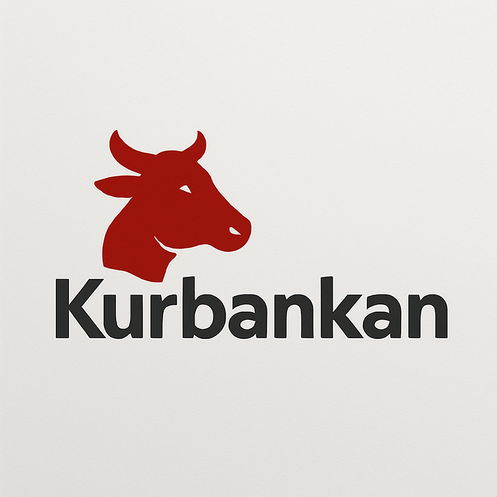
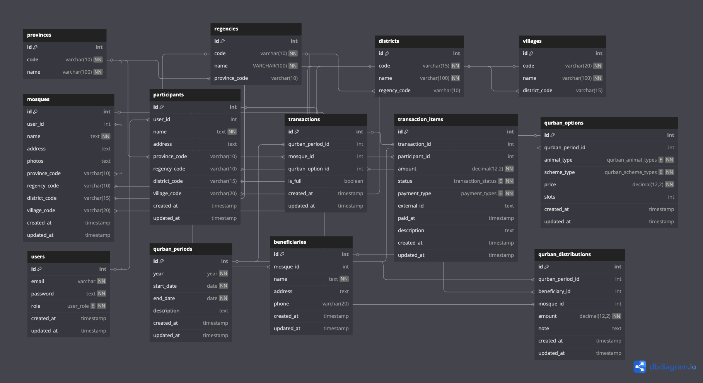

# Kurbankan 🐄

<b>Kurbankan</b> is a platform that makes it easy for users to perform Qurban. Simply choose a mosque based on your location, make a payment via virtual account, and the process will run automatically and transparently.

# DB Schema

# STACK
<ol>
<li>
    
Applications

    <ul>
      <li>GO ✅</li>
      <li>MySQL ✅</li>
      <li>Gorm ✅</li>
      <li>JWT ✅</li>
    </ul>
</li>
<li>
    
Integration

    <ul>
      <li>Xendit Virtual Account ✅</li>
      <li>Xendit Disbursement ✅</li>
    </ul>
</li>
<li>
    
Deployments

    <ul>
      <li>Github Actions CI/CD 🔄</li>
      <li>Build with Dockerfile 🔄</li>
      <li>Docker Compose 🔄</li>
      <li>Nginx 🔄</li>
      <li>Cloudflare 🔄</li>
    </ul>
</li>
<li>
    
Observability 🔄

</li>
</ol>